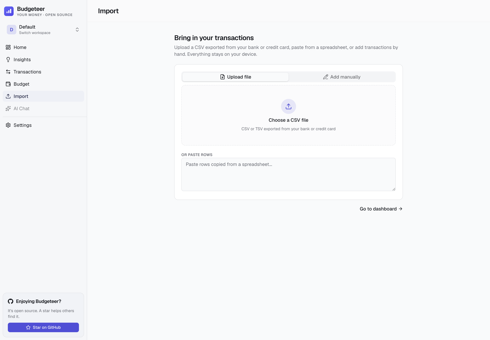
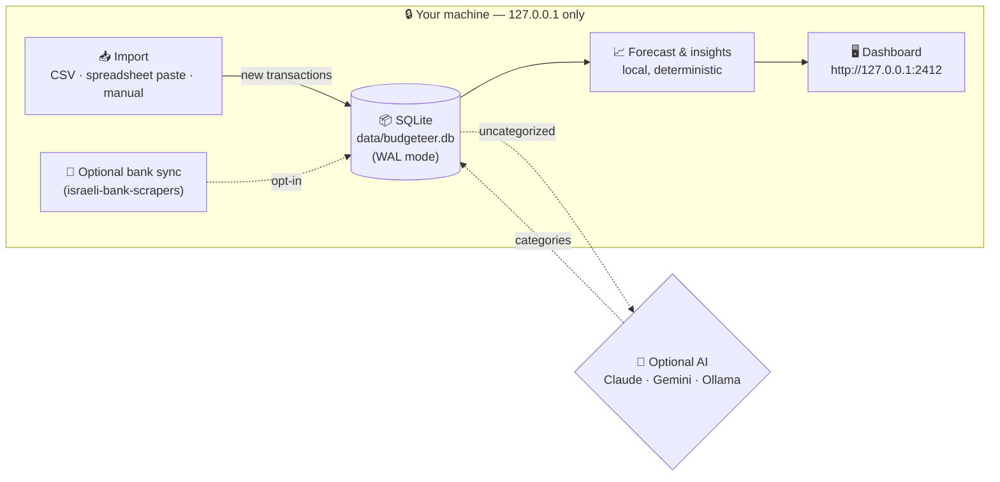

<div align="center">


# Budgeteer

**RiseUp, but free, open-source, and local-first.**
Forecast your month, see what's safe to spend, and find where to save. All on your machine.

[](https://shaya16.github.io/budgeteer/)
[](https://shaya16.github.io/budgeteer/getting-started)
[](https://shaya16.github.io/budgeteer/install/mac)

[](https://nextjs.org/)
[](https://react.dev/)
[](https://www.typescriptlang.org/)
[](https://sqlite.org/)
[](#license)
[](#features)
[](https://github.com/barad-side-hustle/budgeteer/actions/workflows/ci.yml)

</div>

> [!WARNING]
> Personal, local-only tool. The optional bank scraper may violate a bank's Terms of Service. Use only for your own accounts on your own machine. **Do not deploy as a hosted service.**

<div align="center">


</div>

## Why Budgeteer?

[RiseUp](https://www.riseup.co.il/) showed Israelis how good it feels to know, on any given day, whether the month is heading for a plus or a minus and exactly how much is safe to spend. It's a lovely product, but it's a paid subscription that connects to your accounts in the cloud. Budgeteer brings the same calm, forward-looking experience to people who'd rather pay nothing and keep their data on their own laptop.

You bring your transactions in yourself: **import a CSV from your bank or credit card, paste from a spreadsheet, or type them in by hand.** They land in a local SQLite file you can `cp` and back up like any other file. From there Budgeteer forecasts where your month is going, shows what's safe to spend per day, splits fixed from variable, and surfaces practical, non-judgmental ways to save.

Everything runs locally with **no cloud, no subscription, and no external financial-data provider required.** AI categorization is optional (Claude, Gemini, local Ollama, or none), and connecting an Israeli bank for automatic sync is an opt-in power feature, never a requirement.

### How it's different from RiseUp

| | **RiseUp** | **Budgeteer** |
|---|---|---|
| Cost | Paid subscription | Free & open source |
| Data | Cloud | 100% on your machine |
| Getting data in | Open-banking connection | CSV / Excel paste / manual / optional bank scraper |
| Cash-flow forecast | ✅ | ✅ |
| Safe-to-spend & overdraft warning | ✅ | ✅ |
| Savings suggestions | ✅ | ✅ |
| Self-hostable & hackable | ❌ | ✅ |

## Features

<table>
<tr>
<td width="33%" valign="top">

### 📈 Cash-flow forecast
The "bottom line" front and center: a clear verdict on whether you'll finish the month in the plus or the minus, your projected income vs spending, and the expected month-end balance.

</td>
<td width="33%" valign="top">

### 💸 Safe to spend & overdraft alerts
A daily and weekly amount that keeps you on track, plus an overdraft warning when your balance is heading below zero. Fixed commitments like rent are counted once, never extrapolated.

</td>
<td width="33%" valign="top">

### 📥 Local-first import
Upload a CSV from your bank or credit card, paste rows from a spreadsheet, or add transactions by hand. Smart column mapping, signed amounts, and idempotent re-imports. No account, no cloud.

</td>
</tr>
<tr>
<td valign="top">

### 💰 Ways to save
Practical, non-judgmental suggestions: recurring charges you could cancel, categories running above your usual, big variable categories worth trimming, and avoidable bank fees — each with a ₪/month estimate.

</td>
<td valign="top">

### 🧱 Fixed vs variable
Recurring-charge detection splits your committed monthly spend (rent, bills, subscriptions) from the flexible part, so you can see what's truly discretionary.

</td>
<td valign="top">

### 🤖 Optional AI categorization
Auto-categorize with Claude (Anthropic), Gemini (Google), or fully local Ollama — or skip AI entirely and categorize by hand. Everything works without it.

</td>
</tr>
<tr>
<td valign="top">

### 🔒 Local-only & private
No cloud, no account, no telemetry. The server binds to `127.0.0.1` only and your data never leaves `data/`. Credentials (if you connect a bank) are AES-256-GCM encrypted.

</td>
<td valign="top">

### 🌓 Light & dark theme
Polished buttercream-and-sage palette in light mode, warm charcoal in dark. System-aware by default.

</td>
<td valign="top">

### 💬 Chat with your spending
An optional AI chat agent at `/chat` answers questions about your transactions, budgets, and categories, using the provider you picked.

</td>
</tr>
<tr>
<td valign="top">

### 🏦 Optional bank sync
Prefer automatic updates? Connect an Israeli bank or card issuer (18 supported, from Isracard and Hapoalim to One Zero) in **Settings → Banks**. Entirely opt-in.

</td>
<td valign="top">

### 🔍 Merchant memory & transfers
Correct a category once and the same merchant is remembered. Credit-card payments and inter-account transfers are auto-detected and excluded from spending.

</td>
<td valign="top">

### 📊 Budgets & history
Hierarchical categories, monthly targets with pacing, per-category drilldown, and multi-month trends.

</td>
</tr>
<tr>
<td colspan="3" valign="top">

### 🌐 English & Hebrew (RTL)
Toggle between English (default) and עברית from **Settings → Appearance**. Hebrew flips the entire app to right-to-left with translated UI, bank names, predefined categories, currency, and date formatting. Powered by [`next-intl`](https://next-intl.dev/) — drop in a new `<locale>.json` under [`src/i18n/messages/`](src/i18n/messages/) to add another language.

</td>
</tr>
</table>

## Screenshots

<table>
<tr>
<td width="50%" align="center"><b>This month — light</b></td>
<td width="50%" align="center"><b>This month — dark</b></td>
</tr>
<tr>
<td></td>
<td></td>
</tr>
<tr>
<td align="center"><b>Insights & ways to save</b></td>
<td align="center"><b>Import (CSV / paste / manual)</b></td>
</tr>
<tr>
<td></td>
<td></td>
</tr>
<tr>
<td align="center"><b>Onboarding</b></td>
<td align="center"><b>Transactions</b></td>
</tr>
<tr>
<td></td>
<td></td>
</tr>
<tr>
<td align="center"><b>Categories</b></td>
<td align="center"><b>AI provider (optional)</b></td>
</tr>
<tr>
<td></td>
<td></td>
</tr>
</table>

## How it works



The forecast, savings suggestions, and fixed-vs-variable split are computed locally and deterministically from your transactions. By default Budgeteer is **fully offline** — nothing leaves your machine. The only outbound traffic happens if you opt into a bank connection (to your bank) or a cloud AI provider: `api.anthropic.com` (Claude), Google Gemini API endpoints (Gemini), or `localhost:11434` (Ollama, still local).

## Supported banks

| Bank | Type | Notes |
|---|---|---|
| **Isracard** | Credit card | ID + last 6 of card + password |
| **Visa Cal** | Credit card | Username + password |
| **Max** (formerly Leumi Card) | Credit card | Username + password |
| **American Express IL** | Credit card | Isracard-issued; ID + last 6 + password |
| **Bank Hapoalim** (incl. Poalim wallets) | Bank | User code + password |
| **Bank Leumi** | Bank | Username + password |
| **Mizrahi Tefahot** | Bank | Username + password |
| **Bank Discount** | Bank | ID + password + account number |
| **Mercantile Discount** | Bank | ID + password + account number |
| **First International (FIBI / Beinleumi)** | Bank | Username + password |
| **Otsar Hahayal** | Bank | FIBI subsidiary; username + password |
| **Bank Pagi** | Bank | Username + password |
| **Bank Massad** | Bank | Username + password |
| **Bank Yahav** | Bank | Username + ID + password — 6 months history only |
| **Union Bank** | Bank | Merged into Mizrahi-Tefahot; legacy access |
| **Beyahad Bishvilha** | Card | Histadrut benefits; ID + password |
| **Behatsdaa** | Card | Histadrut subsidies; ID + password |
| **One Zero** | Bank | Programmatic SMS 2FA; email + password + phone |

All of the above are wired through [`israeli-bank-scrapers`](https://github.com/eshaham/israeli-bank-scrapers) and shipped enabled. **One Zero** is the only provider with programmatic 2FA — for the others, disable 2FA on the bank side or use the `showBrowser` manual-2FA fallback.

Don't see your bank? Adding a scraper is a small wrapper around `israeli-bank-scrapers` — see [Contributing](#contributing).

## AI providers

| | **Claude** (Anthropic) | **Gemini** (Google) | **Ollama** (local) | **None** |
|---|---|---|---|---|
| Cost | ~₪0.004 per sync | Free tier available | Free | Free |
| Accuracy | Best | Strong | Good (depends on model) | Manual |
| Network | `api.anthropic.com` | Google Gemini API | `localhost:11434` | Offline |
| Setup | API key | API key from Google AI Studio + choose a model | Install Ollama + pull a model | Nothing |

Default model when Claude is selected: `claude-haiku-4-5-20251001` (cheap, fast, accurate for categorization). Gemini defaults to `gemini-3.5-flash` and lets you choose from stable text models: `gemini-3.5-flash`, `gemini-3.1-flash-lite`, `gemini-2.5-flash`, `gemini-2.5-flash-lite`, and `gemini-2.5-pro`. For Ollama, `llama3.2:3b` is the recommended default.

You can change providers any time from **Settings → AI provider**. Existing categorizations are kept.

## Requirements

- **[Bun 1.3+](https://bun.com)** (used as the package manager and script runner)
- **Node.js 22+** (the runtime for the production server via `next start`)
- **macOS 13+**, **Ubuntu 22+**, or **Windows 11**
- A bank account with **2FA disabled** (most Israeli banks require this for automation — OneZero is the exception)

## Install

```bash
git clone https://github.com/barad-side-hustle/budgeteer.git
cd spent
bun install
bun run build
bun start
```

`bun start` runs the production server bound to `127.0.0.1:2412` — loopback only, so it is never reachable from your LAN or the internet. Leave the process running (or wrap it in your own service manager / `tmux` / login item) for an always-on dashboard.

Open **`http://127.0.0.1:2412`** and bookmark it.

To hack on the app with hot reload instead, run `bun dev` and open `http://127.0.0.1:3000`.

## First-time setup

In the browser:

1. **Welcome** — a quick tour of the local-first, private, free idea.
2. **Add your money** — import a CSV from your bank or credit card, paste rows from a spreadsheet, or add a few transactions by hand. (Prefer automatic bank sync? Skip this and connect a bank later in **Settings → Banks**.)
3. **Set your current balance** — optional, but it unlocks the expected month-end balance and overdraft warnings.
4. **Done.** Your dashboard opens with the month's forecast, what's safe to spend, and where you can save.

Optional, any time afterward: pick an AI provider in **Settings → AI** for auto-categorization, set a monthly spending target, or connect an Israeli bank in **Settings → Banks** for automatic syncs.

## How you'll use it

| What you want | Run |
|---|---|
| Just use the app | `bun start` → `http://127.0.0.1:2412` |
| Code and see changes instantly | `bun dev` → `http://127.0.0.1:3000` |
| Rebuild after editing | `bun run build` then restart `bun start` |
| Run the full CI gate locally before pushing | `bun run ci` |

## Uninstall

Budgeteer installs nothing outside the project folder. To remove it:

- Stop the running `bun start` (or `bun dev`) process.
- `rm -rf data/` to wipe your transactions, budgets, and encryption key.
- Delete the repository to remove Budgeteer entirely: `cd .. && rm -rf spent/`.

## Security at a glance

| Concern | Defense |
|---|---|
| Credentials at rest | AES-256-GCM, encryption key file mode `0600` (server refuses to start otherwise) |
| Network exposure | Bound to `127.0.0.1` only — not reachable from your LAN or the internet |
| Browser CSRF | Origin / Referer validation on every mutation |
| Bot detection | Chromium sandbox on by default (`BUDGETEER_DISABLE_CHROMIUM_SANDBOX=1` to opt out) |
| Bundle integrity | `israeli-bank-scrapers`, `better-sqlite3`, and `@anthropic-ai/sdk` pinned to exact versions |
| Browser hardening | Strict CSP, `X-Frame-Options: DENY`, `Permissions-Policy` locks down camera/mic/geo/payment |

**Turn on full-disk encryption** (FileVault / BitLocker / LUKS). The encryption key file sits next to the database, so disk-level protection is your last line of defense if the laptop is lost.

Full threat model and responsible-disclosure policy → [docs/SECURITY.md](docs/SECURITY.md).

## Where your data lives

- `data/budgeteer.db` — transactions, categories, budgets, settings
- `data/.encryption-key` — 32-byte AES key, mode `0600`

Back up `data/` like any other folder. To migrate to a new machine, copy `data/` over and start the app there.

## Architecture & code map

```
spent/
├── src/
│   ├── app/                  Next.js App Router (routes + API)
│   │   ├── (dashboard)/      Dashboard, transactions, settings pages
│   │   ├── api/              Sync (SSE), summary, transactions, setup
│   │   └── setup/            First-run wizard
│   ├── components/
│   │   ├── home/             Forecast hero, breakdown, movers, spending pace
│   │   ├── insights/         Recommendations, savings, fixed-vs-variable
│   │   ├── import/           CSV/paste/manual import panel
│   │   ├── setup/            Welcome, add-money, balance onboarding steps
│   │   └── settings/         Per-tab settings panels
│   ├── lib/                  Shared client-side types, helpers, CSV parser
│   └── server/
│       ├── ai/               Claude + Gemini + Ollama provider implementations
│       ├── insights/         Forecast, recurring, savings, recommendations (pure + engine)
│       ├── import/           Local import commit path
│       ├── db/               SQLite singleton, migrations, query helpers
│       ├── lib/              Encryption, dedup, transfer detection, pace
│       └── scrapers/         Wrapper around israeli-bank-scrapers
├── scripts/                  Dev utilities + the i18n / changed-file-lint CI helpers
├── website/                  Astro + Starlight docs site (auto-deploys to GitHub Pages)
├── .github/workflows/        CI gate + docs site deploy
└── data/                     SQLite + encryption key (gitignored)
```

## Troubleshooting

> The [Troubleshooting docs](https://shaya16.github.io/budgeteer/troubleshooting/) cover Defender, Gatekeeper, Cloudflare bot challenges, and bank-specific quirks in more depth.

## Roadmap

- [x] Local-first import (CSV, spreadsheet paste, manual entry)
- [x] Cash-flow forecast: plus/minus verdict, expected month-end balance, overdraft risk
- [x] Safe-to-spend (daily & weekly) with fixed-vs-variable awareness
- [x] Savings opportunities and human-readable recommendations
- [x] Hebrew UI with full RTL layout
- [x] Optional Israeli bank sync via `israeli-bank-scrapers` (incl. One Zero 2FA)
- [x] Optional AI categorization (Claude, Gemini, Ollama) + AI chat
- [x] Multiple workspaces
- [ ] Excel (.xlsx) import without a CSV export step
- [ ] CSV / OFX export
- [ ] Recurring-bill calendar and upcoming-charges view
- [ ] Custom user-defined categories
- [ ] Mobile companion (Phase 2)

## Contributing

Budgeteer is built for personal use first, open-source second. PRs welcome for:

- **New bank integrations** — add to `BANK_PROVIDERS` in [src/lib/types.ts](src/lib/types.ts), map to `CompanyTypes` in [src/server/scrapers/index.ts](src/server/scrapers/index.ts), flip `enabled: true`.
- **New AI providers** — implement the `AIProvider` interface from [src/server/ai/types.ts](src/server/ai/types.ts), register in [src/server/ai/factory.ts](src/server/ai/factory.ts), and add an option to the setup wizard.
- **New languages** — add `<locale>.json` under [src/i18n/messages/](src/i18n/messages/), mirroring the keys in `en.json`, and append the locale to [src/i18n/routing.ts](src/i18n/routing.ts). Toggle wires itself up automatically.
- **UI polish, bug fixes, documentation.**

Conventions:

- TypeScript strict mode. No `any` without a comment.
- Conventional commits: `feat:`, `fix:`, `chore:`, `docs:`, `refactor:`.
- Comments only where the "why" isn't obvious. No em dashes in code, commits, or docs.
- Run `bun run ci` before opening a PR — same five checks GitHub Actions enforces strictly: formatter (Biome), TypeScript, i18n keys (next-intl-recommended `@lingual/i18n-check`), dead code (knip), React Compiler healthcheck, and `bun test`.

## License

MIT

## Acknowledgments

Built on the shoulders of:

- [`israeli-bank-scrapers`](https://github.com/eshaham/israeli-bank-scrapers) — the heart of every bank integration
- [Next.js 16](https://nextjs.org/) and [React 19](https://react.dev/)
- [`shadcn/ui`](https://ui.shadcn.com/) on top of [`base-ui`](https://base-ui.com/)
- [`better-sqlite3`](https://github.com/WiseLibs/better-sqlite3)
- [`next-intl`](https://next-intl.dev/) for English / Hebrew i18n
- [Anthropic Claude](https://www.anthropic.com/), [Google Gemini](https://ai.google.dev/), and the local-LLM crew at [Ollama](https://ollama.com/)
