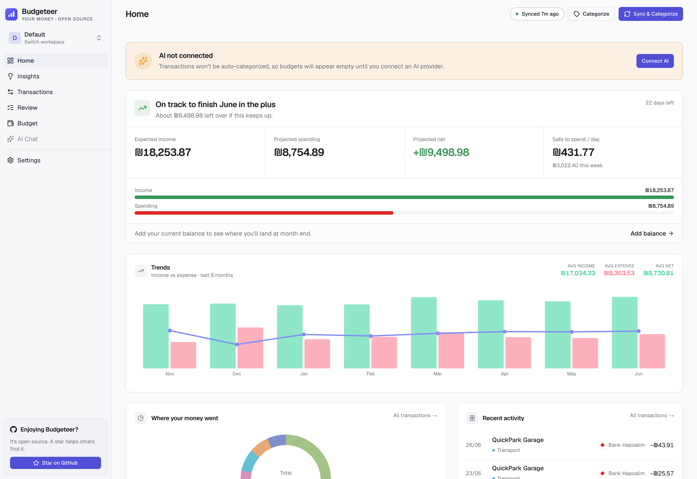
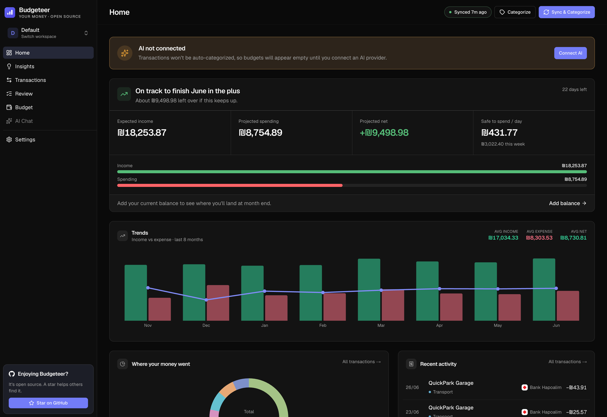
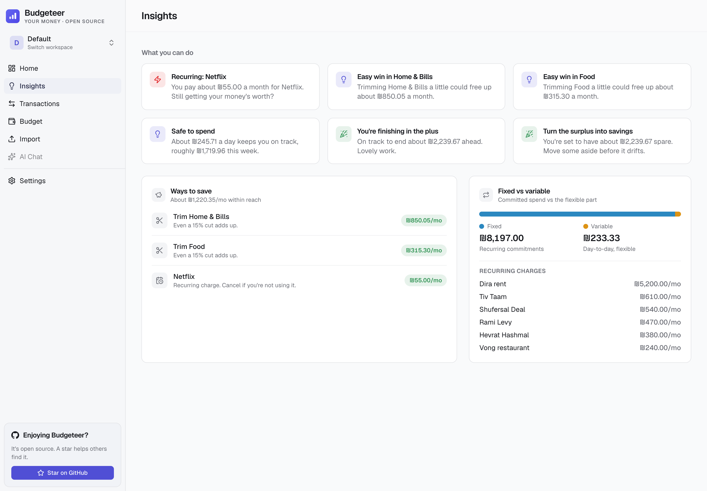
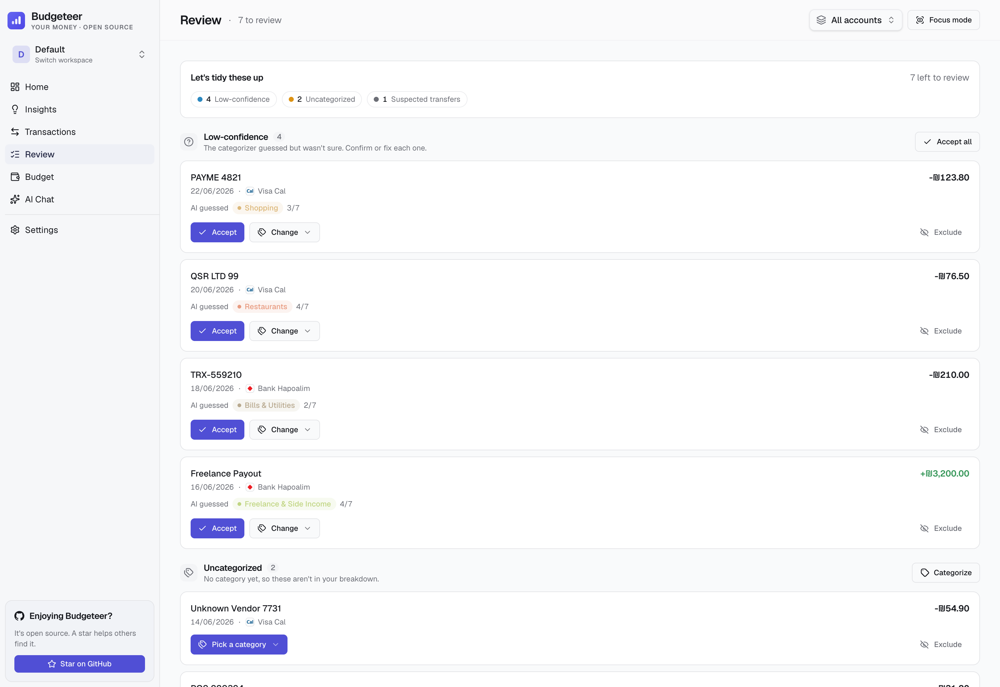
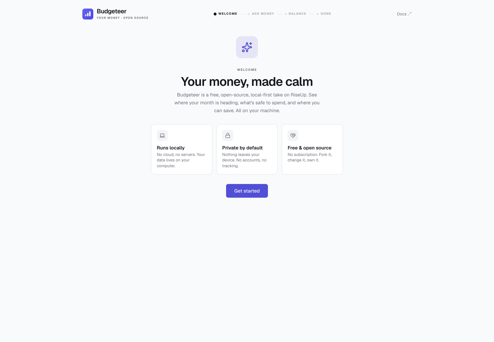
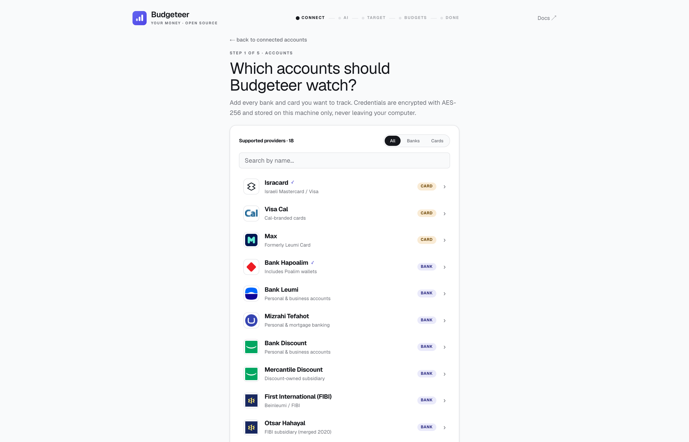
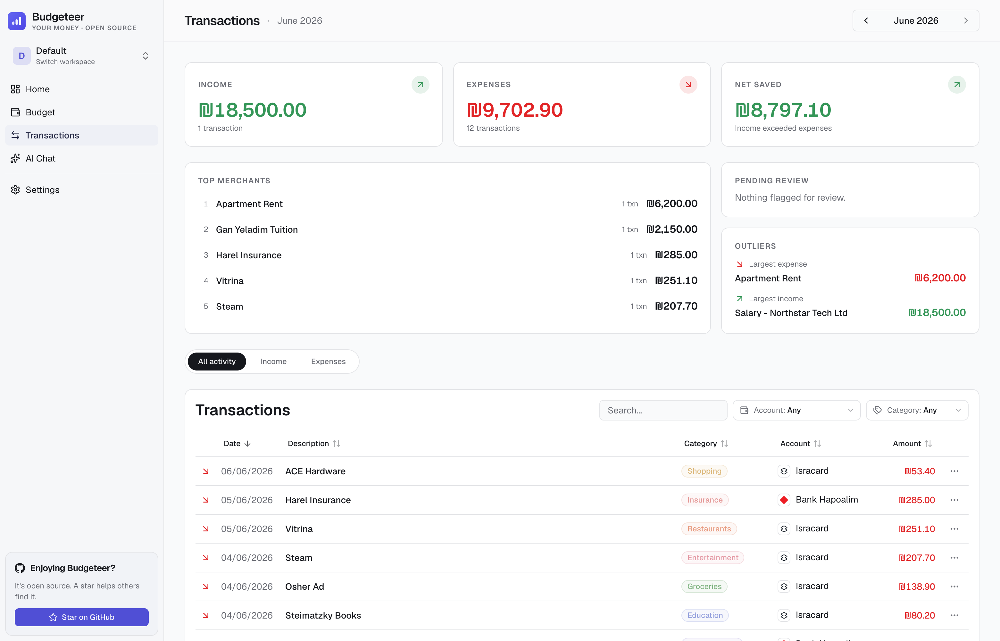
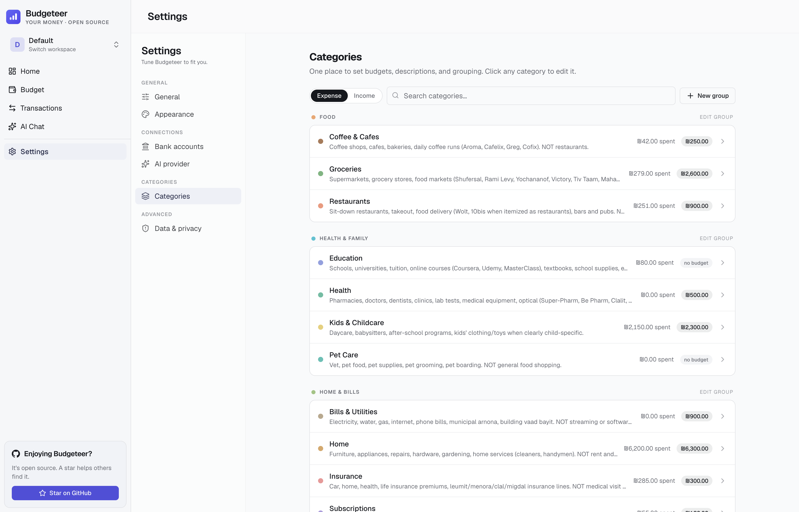
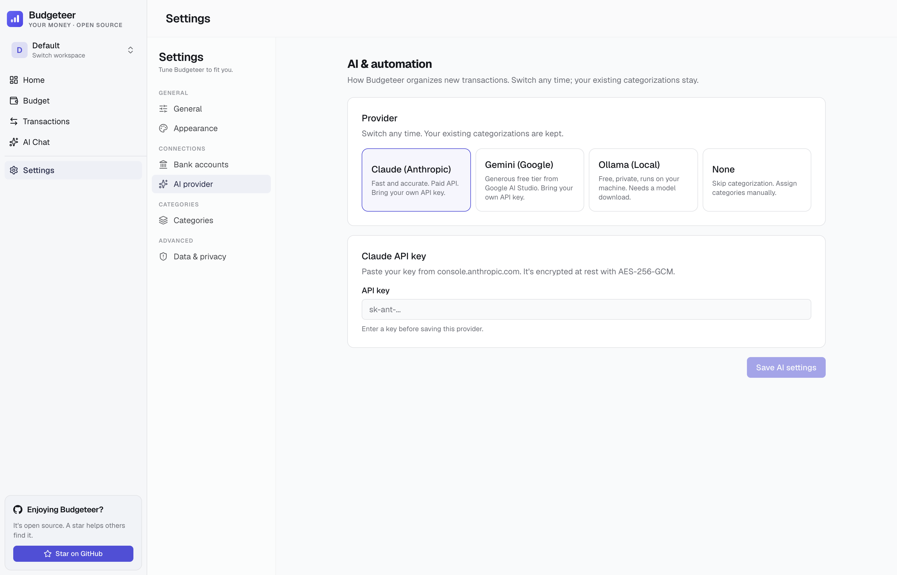
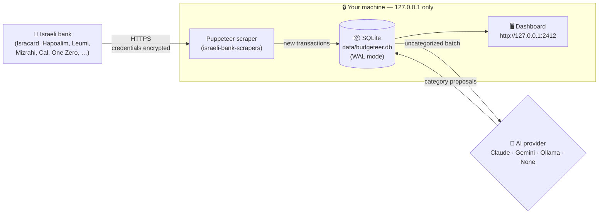

<div align="center">


# Budgeteer

**RiseUp, but free, open-source, and local-first.**
Connect your Israeli bank, forecast your month, and see what's safe to spend. Encrypted, on your own machine.

[](https://shaya16.github.io/budgeteer/)
[](https://shaya16.github.io/budgeteer/getting-started)
[](https://shaya16.github.io/budgeteer/install/mac)

[](https://nextjs.org/)
[](https://react.dev/)
[](https://www.typescriptlang.org/)
[](https://sqlite.org/)
[](#license)
[](#features)
[](https://github.com/barad-side-hustle/budgeteer/actions/workflows/ci.yml)

</div>

> [!WARNING]
> Personal, local-only tool. Scraping financial institutions may violate their Terms of Service. Use only for your own accounts on your own machine. **Do not deploy as a hosted service.**

<div align="center">



</div>

## Why Budgeteer?

Israeli banks have terrible exports, YNAB doesn't speak ILS gracefully, and every "cloud finance" app wants you to hand over your bank password. Budgeteer is the answer for people who'd rather just run something on their own laptop.

Your transactions get pulled directly from your bank with [`israeli-bank-scrapers`](https://github.com/eshaham/israeli-bank-scrapers), stored in a local SQLite file you can `cp` and back up like any other file, and categorized by an AI provider you choose: paid Claude, Gemini, free local Ollama, or nothing at all.

The trade-off is honest: you self-host, you trust the scraper, and you accept that banks may not love automation. In return you get a fast, beautiful, fully offline dashboard that never phones home.

And it's forward-looking like [RiseUp](https://www.riseup.co.il/): Budgeteer forecasts whether you'll finish the month in the plus or the minus, tells you what's safe to spend per day, splits fixed from variable, and suggests practical ways to save, all computed locally from your own transactions.

## Features

<table>
<tr>
<td width="33%" valign="top">

### 📈 Cash-flow forecast
The "bottom line" front and center: will you finish the month in the plus or the minus, your projected income vs spending, expected month-end balance, and an overdraft warning. Fixed commitments like rent are counted once, not extrapolated. A Trends chart below it shows income vs expense vs net side by side for the last several months, so you can spot patterns at a glance.

</td>
<td width="33%" valign="top">

### 💸 Safe to spend & ways to save
A daily and weekly amount that keeps you on track, plus friendly, non-judgmental suggestions: subscriptions to cancel, categories running high, and avoidable fees, each with a ₪/month estimate. A "Worth a look" panel flags likely double charges, unfamiliar foreign charges, merchant prices that crept up, brand-new subscriptions, and interest or fee spikes.

</td>
<td width="33%" valign="top">

### ✅ Guided review queue
Low-confidence guesses, uncategorized rows, and suspected transfers are grouped on a dedicated Review page. Accept, recategorize, or exclude in a click, or enter Focus mode to step through them one at a time.

</td>
</tr>
<tr>
<td width="33%" valign="top">

### 🏦 Israeli bank integration
18 banks and card issuers ship enabled out of the box, from Isracard, Hapoalim, Leumi, Mizrahi, and Cal to One Zero (with programmatic SMS 2FA).

</td>
<td width="33%" valign="top">

### 🤖 AI categorization
Choose Claude (Anthropic) for best accuracy, Gemini (Google) for a generous free tier, Ollama for fully local LLMs, or skip and categorize manually.

</td>
<td width="33%" valign="top">

### 🔒 Local-only & encrypted
Credentials encrypted with AES-256-GCM. Server binds to `127.0.0.1` only — never reachable from your LAN or the internet.

</td>
</tr>
<tr>
<td valign="top">

### 📊 Budgets with pacing
Hierarchical categories, monthly targets, an "ahead of pace" hero card, per-category drilldown, and a top-bar filter to focus every page on a single account.

</td>
<td valign="top">

### 🌓 Light & dark theme
Polished buttercream-and-sage palette in light mode, warm charcoal in dark. System-aware by default.

</td>
<td valign="top">

### 🔒 Runs entirely on your machine
No cloud, no account, no telemetry. The server binds to loopback only and your data never leaves `data/`.

### 💬 Chat with your spending
A built-in AI chat agent at `/chat` answers questions about your transactions, budgets, and categories. Uses the same provider you picked for categorization.

</td>
</tr>
<tr>
<td valign="top">

### 🎯 Auto-detected transfers
Credit card payments and inter-account moves are recognized and excluded from spending totals. When a card bill cannot be matched automatically, link it to the right card from **Settings → Card matching** (or the transaction row menu) and rebuild, so the bill is never double-counted.

</td>
<td valign="top">

### 📅 Multi-month history
Pull up to 3 months of transactions per sync (configurable). Most banks support 12 months total.

</td>
<td valign="top">

### 🔍 Merchant memory
Once you correct an AI categorization, Budgeteer remembers — same merchant goes to the right category next time.

</td>
</tr>
<tr>
<td colspan="3" valign="top">

### 🌐 English & Hebrew (RTL)
Toggle between English (default) and עברית from **Settings → Appearance**. Hebrew flips the entire app to right-to-left with translated UI, bank names, predefined categories, currency, and date formatting. Powered by [`next-intl`](https://next-intl.dev/) — drop in a new `<locale>.json` under [`src/i18n/messages/`](src/i18n/messages/) to add another language.

</td>
</tr>
<tr>
<td colspan="3" valign="top">

### ❓ Per-page help panels
Every data page (Home, Transactions, Review, Budget, Insights) has a help button in the header that opens a side panel explaining each pane in plain English and Hebrew: cash flow, trends, card-bill matching, budgets, anomalies, and more.

</td>
</tr>
</table>

## Screenshots

<table>
<tr>
<td width="50%" align="center"><b>This month — light</b></td>
<td width="50%" align="center"><b>This month — dark</b></td>
</tr>
<tr>
<td></td>
<td></td>
</tr>
<tr>
<td align="center"><b>Insights & ways to save</b></td>
<td align="center"><b>Review queue</b></td>
</tr>
<tr>
<td></td>
<td></td>
</tr>
<tr>
<td align="center"><b>Onboarding</b></td>
<td align="center"><b>Connect a bank</b></td>
</tr>
<tr>
<td></td>
<td></td>
</tr>
<tr>
<td align="center"><b>Transactions</b></td>
<td align="center"><b>Settings</b></td>
</tr>
<tr>
<td></td>
<td></td>
</tr>
<tr>
<td align="center"><b>Categories</b></td>
<td align="center"><b>AI provider</b></td>
</tr>
<tr>
<td></td>
<td></td>
</tr>
</table>

## How it works



Everything inside the dashed box stays on your laptop. The only outbound traffic is to your bank (for scraping) and optionally `api.anthropic.com` (if you chose Claude), Google Gemini API endpoints (if you chose Gemini), or `localhost:11434` (if you chose Ollama).

## Supported banks

| Bank | Type | Notes |
|---|---|---|
| **Isracard** | Credit card | ID + last 6 of card + password |
| **Visa Cal** | Credit card | Username + password |
| **Max** (formerly Leumi Card) | Credit card | Username + password |
| **American Express IL** | Credit card | Isracard-issued; ID + last 6 + password |
| **Bank Hapoalim** (incl. Poalim wallets) | Bank | User code + password |
| **Bank Leumi** | Bank | Username + password |
| **Mizrahi Tefahot** | Bank | Username + password |
| **Bank Discount** | Bank | ID + password + account number |
| **Mercantile Discount** | Bank | ID + password + account number |
| **First International (FIBI / Beinleumi)** | Bank | Username + password |
| **Otsar Hahayal** | Bank | FIBI subsidiary; username + password |
| **Bank Pagi** | Bank | Username + password |
| **Bank Massad** | Bank | Username + password |
| **Bank Yahav** | Bank | Username + ID + password — 6 months history only |
| **Union Bank** | Bank | Merged into Mizrahi-Tefahot; legacy access |
| **Beyahad Bishvilha** | Card | Histadrut benefits; ID + password |
| **Behatsdaa** | Card | Histadrut subsidies; ID + password |
| **One Zero** | Bank | Programmatic SMS 2FA; email + password + phone |

All of the above are wired through [`israeli-bank-scrapers`](https://github.com/eshaham/israeli-bank-scrapers) and shipped enabled. **One Zero** is the only provider with programmatic 2FA — for the others, disable 2FA on the bank side or use the `showBrowser` manual-2FA fallback.

Don't see your bank? Adding a scraper is a small wrapper around `israeli-bank-scrapers` — see [Contributing](#contributing).

## AI providers

| | **Claude** (Anthropic) | **Gemini** (Google) | **Ollama** (local) | **None** |
|---|---|---|---|---|
| Cost | ~₪0.004 per sync | Free tier available | Free | Free |
| Accuracy | Best | Strong | Good (depends on model) | Manual |
| Network | `api.anthropic.com` | Google Gemini API | `localhost:11434` | Offline |
| Setup | API key | API key from Google AI Studio + choose a model | Install Ollama + pull a model | Nothing |

Default model when Claude is selected: `claude-haiku-4-5-20251001` (cheap, fast, accurate for categorization). Gemini defaults to `gemini-3.5-flash` and lets you choose from stable text models: `gemini-3.5-flash`, `gemini-3.1-flash-lite`, `gemini-2.5-flash`, `gemini-2.5-flash-lite`, and `gemini-2.5-pro`. For Ollama, `llama3.2:3b` is the recommended default.

You can change providers any time from **Settings → AI provider**. Existing categorizations are kept.

## Requirements

- **[Bun 1.3+](https://bun.com)** (used as the package manager and script runner)
- **Node.js 22+** (the runtime for the production server via `next start`)
- **macOS 13+**, **Ubuntu 22+**, or **Windows 11**
- A bank account with **2FA disabled** (most Israeli banks require this for automation — OneZero is the exception)

## Install

```bash
git clone https://github.com/barad-side-hustle/budgeteer.git
cd spent
bun install
bun run build
bun start
```

`bun start` runs the production server bound to `127.0.0.1:2412` — loopback only, so it is never reachable from your LAN or the internet. Leave the process running (or wrap it in your own service manager / `tmux` / login item) for an always-on dashboard.

Open **`http://127.0.0.1:2412`** and bookmark it.

To hack on the app with hot reload instead, run `bun dev` and open `http://127.0.0.1:3000`.

## First-time setup

In the browser:

1. **Welcome** — a quick tour of the local-first, private, free idea.
2. **Connect your bank** — credentials are AES-256-GCM encrypted before they touch disk.
3. **Choose an AI provider** — Claude (default), Gemini, Ollama, or none.
4. **Set your monthly target** — the spend you want to stay under each month (optional).
5. **Set per-category budgets** — type an amount on any category to budget it; leave blank to track without a limit (optional).
6. **Done.** Sync starts automatically: a few months of transactions, then AI categorization. Your dashboard opens with the month's forecast.

## How you'll use it

| What you want | Run |
|---|---|
| Just use the app | `bun start` → `http://127.0.0.1:2412` |
| Code and see changes instantly | `bun dev` → `http://127.0.0.1:3000` |
| Show a demo without your real data | `bun run seed:demo` then `bun run demo` |
| Rebuild after editing | `bun run build` then restart `bun start` |
| Run the full CI gate locally before pushing | `bun run ci` |

## Demo data

Want to show Budgeteer without using your real accounts? Build an isolated demo
database and launch the app against it:

```bash
bun run seed:demo   # creates ./demo-data with a "Demo" workspace of synthetic data
bun run demo        # runs the app on the demo database at http://127.0.0.1:3000
```

The demo data is entirely fake and lives in a gitignored `demo-data/` folder,
separate from your real `data/`. Rerun `bun run seed:demo` anytime to rebuild it
from scratch. To return to your real data, stop the demo and run `bun dev` again.

> Stop your real `bun dev` server before running `bun run demo`. The Next.js dev
> server keeps one daemon per project folder, so a second dev process started
> from the same folder reuses the first one and would show your real data instead
> of the demo. Run only one at a time.

## Uninstall

Budgeteer installs nothing outside the project folder. To remove it:

- Stop the running `bun start` (or `bun dev`) process.
- `rm -rf data/` to wipe your transactions, budgets, and encryption key.
- Delete the repository to remove Budgeteer entirely: `cd .. && rm -rf spent/`.

## Security at a glance

| Concern | Defense |
|---|---|
| Credentials at rest | AES-256-GCM, encryption key file mode `0600` (server refuses to start otherwise) |
| Network exposure | Bound to `127.0.0.1` only — not reachable from your LAN or the internet |
| Browser CSRF | Origin / Referer validation on every mutation |
| Bot detection | Chromium sandbox on by default (`BUDGETEER_DISABLE_CHROMIUM_SANDBOX=1` to opt out) |
| Bundle integrity | `israeli-bank-scrapers`, `better-sqlite3`, and `@anthropic-ai/sdk` pinned to exact versions |
| Browser hardening | Strict CSP, `X-Frame-Options: DENY`, `Permissions-Policy` locks down camera/mic/geo/payment |

**Turn on full-disk encryption** (FileVault / BitLocker / LUKS). The encryption key file sits next to the database, so disk-level protection is your last line of defense if the laptop is lost.

Full threat model and responsible-disclosure policy → [docs/SECURITY.md](docs/SECURITY.md).

## Where your data lives

- `data/budgeteer.db` — transactions, categories, budgets, settings
- `data/.encryption-key` — 32-byte AES key, mode `0600`

Back up `data/` like any other folder. To migrate to a new machine, copy `data/` over and start the app there.

## Architecture & code map

```
spent/
├── src/
│   ├── app/                  Next.js App Router (routes + API)
│   │   ├── (dashboard)/      Dashboard, transactions, settings pages
│   │   ├── api/              Sync (SSE), summary, transactions, setup
│   │   └── setup/            First-run wizard
│   ├── components/
│   │   ├── dashboard/        Hero card, category grid, budget drawer
│   │   ├── setup/            Bank, AI, target, budgets steps
│   │   └── settings/         Per-tab settings panels
│   ├── lib/                  Shared client-side types and helpers
│   └── server/
│       ├── ai/               Claude + Gemini + Ollama provider implementations
│       ├── db/               SQLite singleton, migrations, query helpers
│       ├── lib/              Encryption, dedup, transfer detection, pace
│       └── scrapers/         Wrapper around israeli-bank-scrapers
├── scripts/                  Dev utilities + the i18n / changed-file-lint CI helpers
├── website/                  Astro + Starlight docs site (auto-deploys to GitHub Pages)
├── .github/workflows/        CI gate + docs site deploy
└── data/                     SQLite + encryption key (gitignored)
```

## Troubleshooting

> The [Troubleshooting docs](https://shaya16.github.io/budgeteer/troubleshooting/) cover Defender, Gatekeeper, Cloudflare bot challenges, and bank-specific quirks in more depth.

## Roadmap

- [x] Cash-flow forecast: plus/minus verdict, expected month-end balance, overdraft risk
- [x] Safe-to-spend, savings opportunities, and a review queue for flagged transactions
- [x] Hebrew UI with full RTL layout
- [x] Visa Cal, Bank Leumi, Mizrahi, Discount, FIBI, and the rest of the `israeli-bank-scrapers` roster
- [x] One Zero with programmatic SMS 2FA
- [x] Gemini as a third AI provider
- [x] AI chat agent for asking questions about your spending
- [x] Multiple workspaces
- [ ] CSV / OFX export
- [ ] Custom user-defined categories
- [ ] Mobile companion (Phase 2)

## Contributing

Budgeteer is built for personal use first, open-source second. PRs welcome for:

- **New bank integrations** — add to `BANK_PROVIDERS` in [src/lib/types.ts](src/lib/types.ts), map to `CompanyTypes` in [src/server/scrapers/index.ts](src/server/scrapers/index.ts), flip `enabled: true`.
- **New AI providers** — implement the `AIProvider` interface from [src/server/ai/types.ts](src/server/ai/types.ts), register in [src/server/ai/factory.ts](src/server/ai/factory.ts), and add an option to the setup wizard.
- **New languages** — add `<locale>.json` under [src/i18n/messages/](src/i18n/messages/), mirroring the keys in `en.json`, and append the locale to [src/i18n/routing.ts](src/i18n/routing.ts). Toggle wires itself up automatically.
- **UI polish, bug fixes, documentation.**

Conventions:

- TypeScript strict mode. No `any` without a comment.
- Conventional commits: `feat:`, `fix:`, `chore:`, `docs:`, `refactor:`.
- Comments only where the "why" isn't obvious. No em dashes in code, commits, or docs.
- Run `bun run ci` before opening a PR — same five checks GitHub Actions enforces strictly: formatter (Biome), TypeScript, i18n keys (next-intl-recommended `@lingual/i18n-check`), dead code (knip), React Compiler healthcheck, and `bun test`.

## License

MIT

## Acknowledgments

Built on the shoulders of:

- [`israeli-bank-scrapers`](https://github.com/eshaham/israeli-bank-scrapers) — the heart of every bank integration
- [Next.js 16](https://nextjs.org/) and [React 19](https://react.dev/)
- [`shadcn/ui`](https://ui.shadcn.com/) on top of [`base-ui`](https://base-ui.com/)
- [`better-sqlite3`](https://github.com/WiseLibs/better-sqlite3)
- [`next-intl`](https://next-intl.dev/) for English / Hebrew i18n
- [Anthropic Claude](https://www.anthropic.com/), [Google Gemini](https://ai.google.dev/), and the local-LLM crew at [Ollama](https://ollama.com/)
